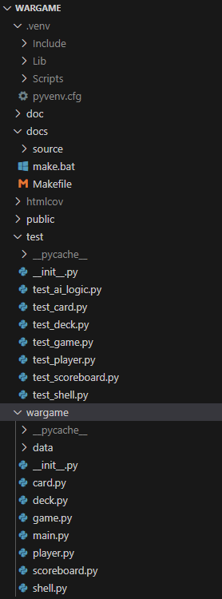

# 🃏 War – The Card Game (Created with Python)
#### A fully object-oriented implementation of the 'War' card game its built as a terminal application using Python's cmd module. Developed as a part of the Test-Driven Development assignment for the course 'Methods for sustainable programming' code: DA214A.

# 🛠️ Features
#### ✅ Playing single player vs computer
#### ✅ Playing multiplayer vs friend
#### ✅ Computer can play on diffrent levels (normal & hard)
#### ✅ Players can change name during gameplay
#### ✅ Scoreboard that is persistent and tracks wins/loses
#### ✅ Ability to restart, auto play rounds and fast-forward until we have a winner or tie using cheat mode
#### ✅ Clear text-based console interface with UTF-8 visuals
#### ✅ Fully tested and linted code
#### ✅ Automatically generated API & UML diagrams

# 🏁 Game Rules Summary
#### 🟢 Each player flips the top card of their deck
#### 🟢 The higher card wins the round and takes both cards
#### 🟢 If both cards are equal, 'war' starts: each player places 3 cards facedown and 1 card up.
#### 🟢 The higher card wins all cards in play
#### 🟢 First to 52 cards wins the game

# 🤖 AI difficullity feature
#### 🟢 We have 2 diffrent levels (Normal & Hard)
#### 🟢 Normal mode: The AI (player2) plays just regular war and theres 50% chance for each to win
#### 🟢 Hard mode: The AI (player2) gets an advantage over the regular player, the AI gets to pick both the top & bottom card, and then have an 80% chance to pick the strongest (highest) card

# 🎯 Scoreboard example
## Stored inside wargame/data/scoreboard.json:
### {
###  "noah": {"games_played": 5, "games_won": 3, "games_lost": 2},
###  "erik": {"games_played": 2, "games_won": 0, "games_lost": 2}
### }
### Keeps track on games_played, games_won, games_lost for each name.

# 🧩 Project Structure

# ⚙️ Installation & Setup
#### 1️⃣ Start up CMD and navigate to desktop -> cd Desktop
#### 2️⃣ Clone repository from github -> https://github.com/NoahNemhed/wargame -> cd wargame
#### 3️⃣ Create a virtual environment -> python -m venv .venv -> Activate venv: . .venv\Scripts\Activate -> Deactivate when done: deactivate
#### 4️⃣ Install dependencies to run applictaion -> pip install requirements.txt
#### 5️⃣ Run the game -> python -m wargame.main
#### 6️⃣ Follow the on-screen commands to play : 
## ---------------------------------------------------------------------------------------------------------------
##### 🎴 Welcome to the War card game! 🎴

##### Commands:
  ##### start [name1] [name2]   -> Start a new game (Defaults to 'Player 1' vs 'Computer' if no names given)
  ##### set_name (<p1> or <p2>) <new_name> -> Change name of player1 (<p1>) or player2 (<p2>)
  ##### set_ai (<normal> or <hard> -> Changes AI difficulty (default normal)
  ##### show_scoreboard         -> Shows the current scoreboard
  ##### play_one_round          -> Play a single round
  ##### auto_play [num_rounds]  -> Auto-play N rounds (defaults to 5 if no number given)
  ##### show_status             -> Show current card counts
  ##### show_rules              -> Display the rules of War
  ##### restart_game            -> Restart the same game
  ##### cheat                   -> Fast-forward to the end
  ##### exit                    -> Exit the game

##### Type 'help' for more info on each command.
## ---------------------------------------------------------------------------------------------------------------

# 🧪 Running Tests
## Run all unit tests at once:
##### ▶️ python -m unittest discover -s test -p "test_*.py" -v
## Run test on files seperatly:
##### ▶️ python -m unittest discover -s test -p "[class name of test file e.g 'test_card'].py" -v
## Check coverage:
##### ▶️ coverage run -m unittest discover
##### ▶️ coverage report -m
## Open coverage report in browser:
##### ▶️ coverage html
##### ▶️ start htmlcov/index.html

# 🧹 Code Quality & Linters
## Check code style and documentation:
##### ▶️ flake8 wargame
##### ▶️ pylint wargame
## Auto format code errors:
##### ▶️ black wargame

# 🧾 Documentation
## Generate API documentation (using pdoc):
##### ▶️ pdoc --html wargame --output-dir doc/pdoc --force
## The documentation will appear in:
##### 📚 doc/pdoc/wargame/

# 📊 UML Diagrams
## Generate UML class and package diagrams:
##### ▶️ pyreverse -o png -p wargame wargame/
##### Files will appear in root, so move them to pyreverse folder

